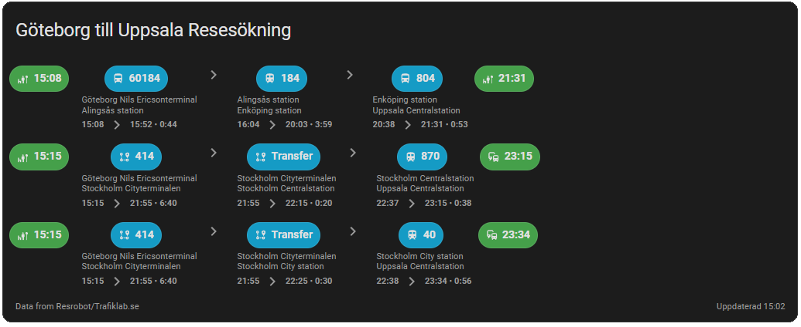

# Trafiklab Travel Search Card

A Home Assistant Lovelace card that shows end-to-end trips from a Trafiklab Resrobot Travel Search sensor.



## Features
- One row per full trip: start endpoint → leg pills with arrows → end endpoint
- Start and end pills show departure and arrival times
- Leg pills show transport icon and line; walk legs show meters; Transfer shows "Transfer"
- Optional details per leg (3 aligned rows): origin, destination, and time row "Dep => Arr • H:MM"
- Handles long trips with middle ellipsis when `max_legs` is exceeded
- Clickable map links for endpoints when coordinates are available (optional)
- Configurable max trips and max legs
- English and Swedish translations

## Requirements
- Home Assistant 2024.1+ (tested)
- Trafiklab Integration 0.4.6+ (Resrobot Travel Search sensor)

## Installation

### HACS (recommended)
1. Add this repository as a custom repository in HACS (Frontend).
2. Install "Trafiklab Travel Search Card".
3. Reload resources when prompted.

### Manual
1. Build or download `trafiklab-travel-card.js` from the latest GitHub release.
2. Copy it to `config/www/trafiklab-travel-card/` on your HA instance.
3. Add a Lovelace resource:
	 - URL: `/local/trafiklab-travel-card/trafiklab-travel-card.js`
	 - Type: `module`
4. Refresh your browser cache (append `?v=1` to the resource URL if needed).

## Add the card

You can add the card from the UI (recommended) or via YAML.

### UI (Visual editor)
- Dashboards → Edit Dashboard → Add Card → search for "Trafiklab Travel".
- Choose the sensor in the CONFIG tab and adjust options.

### YAML example
```yaml
type: custom:trafiklab-travel-card
entity: sensor.trafiklab_travel
show_details: true
show_map_links: true
max_items: 3
max_legs: 12
```

## Configuration options
- `entity` (required): Sensor entity id.
- `show_details` (optional, default `false`): Show 3 aligned detail rows under each leg: origin, destination, and a time row in the form `HH:MM => HH:MM • H:MM`.
- `show_map_links` (optional, default `true`): Link start/end pills to OpenStreetMap when coordinates are available.
- `max_items` (optional, default `3`): Max number of trips to display.
- `max_legs` (optional, default `12`): Max number of legs rendered per trip; if exceeded, legs are truncated with an ellipsis in the middle.

## Sensor data expectations
The card expects a normalized `trips` array under the sensor’s attributes:

```
attributes.trips: [
	{
		legs: [
			{
				category|type,           // e.g., Bus, Train, Walk, Transfer
				line_number|line|number, // line identifier for public transport
				origin_time|departure,   // ISO or "YYYY-MM-DD HH:MM"
				dest_time|arrival,       // ISO or "YYYY-MM-DD HH:MM"
				origin/from { name, lat, lon },
				destination/to { name, lat, lon },
				duration (minutes),
				distance (meters)
			},
			...
		]
	},
	...
]
```

Fallbacks:
- If `attributes.trips` is not present but a `legs` array exists, a single pseudo-trip is created.
- The card will try common key variants (shown above) for better compatibility.

## Behaviors
- Endpoint icons: map-marker for coordinates, otherwise train-bus for train first/last leg, bus-stop-uncovered for others.
- Leg icons: inferred from category/type (bus, train, metro, tram, ferry, walk, taxi). "Express bus" maps to bus.
- Transfer legs: label shows "Transfer" instead of a line number.
- Times: Parses ISO and `YYYY-MM-DD HH:MM`; displays `HH:MM`.
- Duration: Displays total/leg durations as `H:MM`.
- Truncation: When legs exceed `max_legs`, the middle is replaced with `… → …`.
- Accessibility: Header overlay and line pills are keyboard-activatable (Enter/Space) to open more-info.

## Theming
The card exposes CSS variables to tune spacing, sizes, and colors. Common ones:
- `--tl-trip-gap`, `--tl-pill-padding-y`, `--tl-pill-padding-x`, `--tl-pill-radius`
- `--tl-start-pill-bg`, `--tl-end-pill-bg`, `--tl-leg-pill-bg`
- `--tl-icon-size`, `--tl-font-size-leg`, `--tl-font-size-details`, `--tl-font-size-footer`
- `--tl-arrow-color`, `--tl-dots-color`

## Development
- Install deps: `npm ci`
- Dev server: `npm run dev`
- Build: `npm run build` (output in `dist/`)

The build outputs a single `trafiklab-travel-card.js` bundle (with a `.map` for debugging). Only the `.js` is required in HA.

## Troubleshooting
- Card not found: Make sure the resource is added and cache is cleared.
- No trips: Verify the sensor exposes `attributes.trips` or `attributes.legs` and has recent data.
- Incorrect icons or labels: Check the integration version and that categories/fields match the expected keys.

## License
MIT
